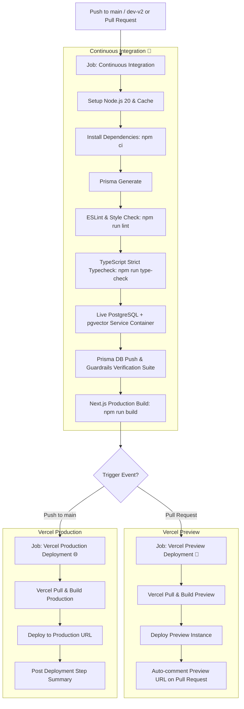

# CI/CD Pipeline Guide — UrFuture (Phlouv)

This document describes the automated Continuous Integration and Continuous Deployment (CI/CD) pipeline implemented for **UrFuture**.

The pipeline is managed via **GitHub Actions** (`.github/workflows/ci-cd.yml`) and delivers automated quality gates and **Vercel** deployments.

---

## 1. Overview of Pipeline Architecture



---

## 2. Pipeline Stages

### 🧪 Continuous Integration (CI)
Runs on every Pull Request and Push to `main` and `dev-v2`.
- **Node.js Environment**: Node 20 LTS with npm dependency caching.
- **Code Quality**: ESLint configured with Next.js core web vitals.
- **Type Safety**: Full TypeScript compilation check (`tsc --noEmit`).
- **Database & RAG Integration**: Spawns an ephemeral `pgvector/pgvector:pg16` service container, synchronizes the database schema using Prisma, and executes the guardrails test suite (`verify-guardrails.ts`).
- **Production Compilation**: Tests the complete Next.js production build (`next build`) to ensure zero packaging or prerendering regressions.

### 🚀 Preview Deployment (CD)
Runs automatically when a Pull Request is opened or updated targeting `main` or `dev-v2`.
- Builds an isolated preview environment on Vercel.
- Automatically creates or updates a comment on the Pull Request with the live Preview URL for instant review and QA testing.

### 🌐 Production Deployment (CD)
Runs automatically when changes are pushed or merged into the `main` branch.
- Deploys the prebuilt, verified production bundle to your primary Vercel production domain.
- Generates a GitHub Actions deployment report in the job summary.

---

## 3. Vercel Configuration & Secrets Setup

To enable automated deployments from GitHub Actions, configure the following 3 repository secrets in GitHub:

### Step 3.1: Get your Vercel Token
1. Go to your [Vercel Account Tokens](https://vercel.com/account/tokens).
2. Click **Create Token** (Name it e.g. `UrFuture-GitHub-Actions`).
3. Copy the generated token string.

### Step 3.2: Get `VERCEL_ORG_ID` and `VERCEL_PROJECT_ID`
In your local terminal, navigate to the `urfuture` directory and link to your Vercel project:

```bash
cd urfuture
npx vercel link
```

This will create a `.vercel/project.json` file containing:
```json
{
  "orgId": "team_xxxxxx",
  "projectId": "prj_xxxxxx"
}
```
- `orgId` corresponds to `VERCEL_ORG_ID`
- `projectId` corresponds to `VERCEL_PROJECT_ID`

*(Alternatively, find `Project ID` in your Vercel Project Settings > General, and your `Team/Org ID` under Team Settings > General).*

### Step 3.3: Add Secrets to GitHub Repository
1. Navigate to your GitHub repository: [LyhaiTe/UrFuture](https://github.com/LyhaiTe/UrFuture).
2. Click **Settings** > **Secrets and variables** > **Actions**.
3. Under **Repository secrets**, click **New repository secret** and add:
   - `VERCEL_TOKEN`: Your Vercel token from Step 3.1.
   - `VERCEL_ORG_ID`: Your Organization / Team ID.
   - `VERCEL_PROJECT_ID`: Your Project ID.

> [!NOTE]
> If these secrets are not yet added, the CI checks (Linting, TypeScript check, Prisma sync, guardrails tests, Next.js build) will still execute and pass cleanly, with a helpful notification logged during the deploy step.

---

## 4. Vercel Project Environment Variables

In your [Vercel Dashboard](https://vercel.com) under **Project Settings > Environment Variables**, ensure these production environment variables are configured:

| Variable | Description |
| :--- | :--- |
| `DATABASE_URL` | Amazon RDS or hosted PostgreSQL URL with `pgvector` enabled |
| `GROQ_API_KEY` | Groq API key for LLM inference |
| `VOYAGE_API_KEY` | Voyage AI API key for embeddings |
| `AUTH_SESSION_SECRET` | 32+ character random string for session tokens |
| `GOOGLE_CLIENT_ID` | *(Optional)* Google OAuth Client ID |
| `GOOGLE_CLIENT_SECRET` | *(Optional)* Google OAuth Client Secret |
| `GOOGLE_REDIRECT_URI` | Google OAuth Callback URL for your production domain |

Also ensure that under **Vercel Project Settings > General**:
- **Root Directory** is set to `urfuture` (if importing the repository directly in Vercel UI).

---

## 5. Local Scripts for CI Verification

You can run the exact verification checks locally before pushing:

```bash
cd urfuture

# 1. Check code formatting & linting
npm run lint

# 2. Check TypeScript types
npm run type-check

# 3. Verify guardrails & database logic
npm run verify:guardrails

# 4. Test production build
npm run build
```
